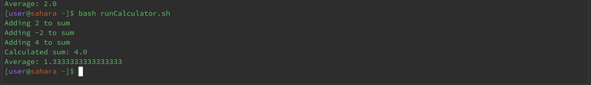

# LAB REPORT 5
# Name: Duong Ngo
# Professor: Joe Gibss Politz

# DEBUGGING SCENERIO 1:
A student Duong Ngo wrote a program to create mini-album management system. She created three files to run her program on Edstem. She had an error message from the terminal and went to Estem discussion to ask questions for her bugs. 
1. The first Java file is named `Album.java`:
```
public class Album {
    public static void main(String[] args) {
        Song favoriteSong = new Song("When the Dawn Comes Again", "Queen");
        favoriteSong.printSongDetails();
    }
}
```
2. The second Java file is named `Song.java`:
```
public class Song {
    private String title;
    private String artist;

    public Song(String title, String artist) {
        this.title = title;
        this.artist = artist;
    }

    public void printSongDetails() {
        System.out.println("Song: " + title + " by " + artist);
    }
}

```
3. The third Bash Script file is named `runAlbum.sh`:
```
#!/bin/bash

# Compile the Java classes
javac Song.java Album.java

rm Song.class

# Run the Album class
java Album
```
# EDSTEM CONVERSATIONS WITH TAS AND STUDENTS:
1. A post from Duong Ngo:
Title: Compilation Error When Running Bash Script for Java Program
Body:
```
Title: Compilation Error When Running Bash Script for Java Program
Body:
Hey everyone,
I'm struggling to run my Java program using a Bash script, but I keep getting a NoClassDefFoundError error.
Attached screenshot below is the output in the terminal showing the bug.
I think there's something wrong with my code compilation when running my Java program within the script,
so I'm a little bit confused of what's going wrong. Does anyone have any ideas? Thank you so much!
```

2. Response from TAs:
```
Hello,
It seems like it is having some trouble finding your class available at compile time but is missing during execution.
Can you double check if all class files are present in the directory from which you're running your Java application?
I recommend you use `ls` command to list all files in the directory and ensure both Albums class and MyCDs class.
Also, could you verify the classpath by running `ls Song.class; echo $CLASSPATH`.
This command will help you to know if the classes are being correctly located by the Java runtime.
```
3. Student's follow-up post:
```
Thank you so much for your help. I tried `ls` command and realized that `Song.class`.
I also checked my classpath with echo $CLASSPATH, and it looks like it wasn't set to include the directory of my classes.
Image attached below is my attempt to do `ls` command and `echo $CLASSPATH`.
I checked the `runAlbums.sh` and realized that I have a line of code which is `rm Song.class`.
I think this is the main error here because I accidentally used the command `rm` so it removed `Song` class when compiling and running a program.
I think I will try to delete that line and add a different one to not trigger the bug anymore.  
```

# SETUP INFORMATION AND FIXING THE BUG: 
1. Set-up information:
```
home/
│
├── runAlbum.sh
├── Album.java
└── Song.java
```
2. The code before fix:
```
#!/bin/bash

# Compile the Java classes
javac Song.java Album.java

rm Song.class

# Run the Album class
java Album
```
3. The code after fix:

```
#!/bin/bash

# Compile the Java classes
javac Song.java Album.java

# Run the Album class
java Album
```
4. The output after the fix:
After deleting the `rm Song.class` code line, the code now runs successfully because I deleted the line which removes the Song.class. Now, when compile and run the program, it first compiles both java files by command `javac Song.java Album.java`. Then, I use command `java Album` to run `Album` file.

It nows can print out the song information that we pass in the `Album.java` method.

# ** DEBUGGING SCENERIO 2:
A student Duong Ngo creating her own simple calculator to do some basic additions, multiplication, division and subtraction. She had an error message from the terminal and went to Edstem discussion to ask questions for her bugs. She created two files to run her calculator project. 
1. The first Java file named `Calculator.java`:
```
public class Calculator {
    public static void main(String[] args) {
        int[] numbers = {2, -2, 4}; // Example array
        double sum = 0;
        for (int num : numbers) {
            if (num >= 0) {
                System.out.println("Adding " + num + " to sum");
                sum += num;
            }
        double average = sum / numbers.length;
        System.out.println("Calculated sum: " + sum);
        System.out.println("Average: " + average);
        }
    }
}

```
2. The second file is bash script named `runCalculator.sh`:
```
#!/bin/bash
javac Calculator.java
java Calculator
```
# EDSTEM CONVERSATIONS WITH TAS AND STUDENTS:
1. A post from Duong Ngo:
Title: Terminal Throwing Exception Error
Body:
```
Hi everyone,

I'm working on my calculator code and have run into a pretty weird issue with division operations.
My expectation when the array includes negative numbers, the calculated average seems incorrect.
For example, calculating the average of [2, -3, 4] gives me 2.
However, its output skipping negative number, which is not expected. Attachment below is the screenshot of the output when I run the program.
```

2. Response from TAs:
```
Can you provide the part of your code that sums up the array elements and calculates the average?
It sounds like the issue might be related to how the sum is being accumulated, including negative numbers.
I recommemend you add print statements to know each element as it's being added to the total sum?
```
3. Student's follow-up post:
```
Thank you for the help. After trying around with the code and adding print statement to the code,
I realized the code accidentally skipping the negative numbers so I will try add if statement
so that it will not skip the negative numbers and count the sum correctly.
```

# SETUP INFORMATION AND FIXING THE BUG: 
1. Set-up information:
```
home/
│
├── runCalculator.sh
├── Calculator.java
```
2. The code before fix: (after adding print statement to know the error)
```
public class Calculator {
    public static void main(String[] args) {
        int[] numbers = {2, -2, 4}; // Example array
        double sum = 0;
        for (int num : numbers) {
            if (num >= 0) { // Incorrectly skipping negative numbers
                System.out.println("Adding " + num + " to sum");
                sum += num;
            } else {
                System.out.println("Skipping " + num);
            }
        }
        double average = sum / numbers.length;
        System.out.println("Calculated sum: " + sum);
        System.out.println("Average: " + average);
    }
}
```
3. The code after fix:
```
public class Calculator {
    public static void main(String[] args) {
        int[] numbers = {2, -2, 4};
        double sum = 0;
        for (int num : numbers) {
            // Correctly adding all numbers to sum
            System.out.println("Adding " + num + " to sum");
            sum += num;
        }
        double average = sum / numbers.length;
        System.out.println("Calculated sum: " + sum);
        System.out.println("Average: " + average);
    }
}
```
4. Output after the fix: After fixing to include all the numbers. I deleted the if condition so when it goes through each number in the array, it does not skip negative numbers. Next, I use `^` to rerun the command `bash Calculator.sh`, thus having a correct average of sum. 



# REFLECTION:
In this second half of the quarter, there are lots of interesting information that I learned from labs and lectures. In lab sections, I learned how to work in groups and improve my coding skills from that. I learned how to share git repository to my teammates so we can make changes together. Additionally, the TAs help me a lot of to further understand Git controls and code bugs that I feel coding is more flexible and approachable to me now. Initially, I had a very little knowledge of Github and viewed it as a platform for coding or apply for jobs only. However, after several weeks of using Github, I am getting more familiar to use Github as a powerful tool for code review, discussion and team projects. This skill is important for me in the future because learning how to adjust code snippets or reviewing codes can significantly improve my code equality and team collaboration.  


